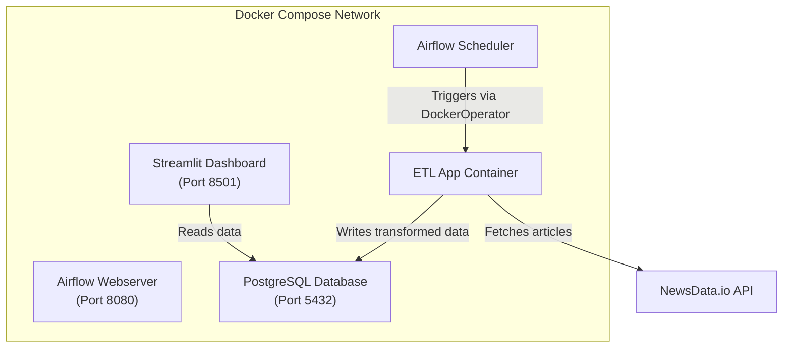

# News ETL Pipeline with Apache Airflow

A production-style data engineering pipeline that extracts news articles from an external API, transforms the data to handle inconsistencies, and loads it into a PostgreSQL database. The pipeline is orchestrated by Apache Airflow running in Docker containers, demonstrating industry-standard workflow automation practices.

## Project Status

**Complete**

This is my first data engineering project, developed to gain hands-on experience with the tools and patterns used in professional data platform environments. The project follows industry-standard practices and demonstrates a methodical approach to building production-ready data pipelines.

| Phase | Status |
|-------|--------|
| ETL Pipeline Development | Complete |
| Workflow Orchestration | Complete |
| Containerization | Complete |
| NLP Processing | Complete |
| Data Validation | Complete |
| Structured Logging | Complete |
| Dashboard Visualization | Complete |
| Incremental Loading | Complete |

## Project Overview

This project implements a complete ETL (Extract, Transform, Load) pipeline that ingests news articles, enriches them with NLP-derived features, validates data quality, and presents insights through an interactive dashboard (future implementation). The project addresses questions such as:

- How can automated pipelines reliably ingest data from external APIs?
- What patterns ensure data quality and prevent duplicate records?
- How do containerized architectures enable reproducible deployments?

### Key Features

**Incremental Loading**: The pipeline tracks the latest article date and only fetches newer content, reducing API calls and improving efficiency.

**Sentiment Analysis**: Each article is enriched with sentiment scores and word counts using TextBlob, transforming raw text into structured analytical features.

**Data Validation**: A validation layer separates valid records from invalid ones, logging rejections with detailed error messages for audit trails.

**Pipeline Observability**: All pipeline events are logged to a dedicated table with structured metadata, enabling monitoring and debugging.

## Architecture


## Technical Approach

### Data Ingestion

The pipeline connects to the NewsData.io API to retrieve English-language news articles. Incremental loading logic queries the database for the maximum `published_at` date and uses this as a filter, ensuring only new articles are fetched on subsequent runs.

### Data Transformation

Raw API responses undergo several transformations:

| Transformation | Description |
|----------------|-------------|
| Author Normalization | Converts list-type creator fields to comma-separated strings |
| Sentiment Scoring | Calculates polarity scores (-1.0 to 1.0) using TextBlob |
| Word Count | Computes article length for content analysis |
| Schema Enforcement | Ensures consistent data types across all records |

### Data Validation

Before database insertion, each article passes through validation checks:

- Primary key existence verification
- Content presence validation (title or body required)
- Sentiment score range verification (-1.0 to 1.0)
- Word count non-negativity check
- Batch duplicate detection

Invalid records are logged with detailed error messages rather than failing the entire pipeline.

### Data Loading

The pipeline uses PostgreSQL's `ON CONFLICT DO UPDATE` clause to implement idempotent upserts. This pattern ensures that re-running the pipeline with overlapping data updates existing records rather than creating duplicates.
```sql
INSERT INTO articles (id, title, author, body, source, published_at, sentiment_score, word_count)
VALUES (...)
ON CONFLICT (id) DO UPDATE SET
    title = EXCLUDED.title,
    sentiment_score = EXCLUDED.sentiment_score,
    updated_at = CURRENT_TIMESTAMP
```

## Technical Stack

| Component | Technology | Purpose |
|-----------|------------|---------|
| Orchestration | Apache Airflow 2.8.1 | DAG scheduling, task management, monitoring |
| Database | PostgreSQL 14 | Article storage, Airflow metadata, pipeline logs |
| Containerization | Docker and Docker Compose | Service isolation, reproducible deployments |
| ETL Application | Python 3.13 | Data extraction, transformation, loading |
| NLP Processing | TextBlob, NLTK | Sentiment analysis, text processing |
| Data Validation | Custom validators | Data quality enforcement |
| Visualization (future implmentation) | Streamlit, Plotly | Interactive dashboard |

## Repository Structure
```
news-etl/
├── dags/
│   └── news_etl_dag.py          # Airflow DAG definition
├── dashboard/
│   ├── Dockerfile               # Dashboard container image
│   ├── requirements.txt         # Dashboard dependencies
│   └── app.py                   # Streamlit application (in progress)
├── logs/                        # Airflow execution logs
├── plugins/                     # Airflow plugins (extensibility)
├── docker-compose.yml           # Multi-container orchestration
├── Dockerfile                   # ETL application image
├── Dockerfile.airflow           # Custom Airflow image with Docker CLI
├── etl.py                       # Core ETL logic
├── validators.py                # Data validation module
├── init-db.sql                  # Database initialization
├── requirements.txt             # ETL dependencies
└── README.md
```

## Getting Started

### Prerequisites

- Docker Desktop installed and running
- A NewsData.io API key (free tier available)

### Installation

1. Clone the repository:
```bash
   git clone https://github.com/yourusername/news-etl.git
   cd news-etl
```

2. Create a `.env` file with your API key:
```
   NEWS_API_KEY=your_api_key_here
   AIRFLOW_UID=50000
```

3. Build and start all services:
```bash
   docker compose up --build
```

4. Build the ETL application image:
```bash
   docker compose build etl_app
```

5. Access the services:
   - Airflow UI: `http://localhost:8080` (credentials: admin/admin)
   - Dashboard: `http://localhost:8501`

6. Enable and trigger the `news_etl_pipeline` DAG from the Airflow interface

## Usage

### Manual Pipeline Trigger

Navigate to the Airflow UI, select the `news_etl_pipeline` DAG, and click the play button to trigger an immediate run.

### Scheduled Execution

The pipeline in its final state will be configured to run daily at midnight UTC. Enable the DAG toggle to activate scheduled execution.

### Verify Data

Connect to PostgreSQL to query ingested articles:
```bash
docker exec -it de_postgres_db psql -U user -d news_db -c "SELECT title, sentiment_score, word_count FROM articles LIMIT 5;"
```

### View Pipeline Logs
```bash
docker exec -it de_postgres_db psql -U user -d news_db -c "SELECT run_timestamp, log_level, message FROM pipeline_logs ORDER BY run_timestamp DESC LIMIT 10;"
```

## What This Project Demonstrates

**Data Engineering Fundamentals**: Complete ETL pipeline design with extraction from external APIs, transformation logic including NLP enrichment, and loading with idempotent upsert patterns.

**Production Practices**: Implementation of incremental loading, data validation gates, structured logging, and error handling that mirrors real-world pipeline requirements.

**Infrastructure as Code**: Multi-container Docker Compose orchestration with health checks, dependency management, and environment variable configuration.

**Workflow Orchestration**: Apache Airflow DAG development with DockerOperator for containerized task execution, demonstrating separation between orchestration and execution layers.

**Full-Stack Data Platform**: End-to-end architecture from data ingestion through storage to visualization, showing ability to own complete data products.

**Software Engineering Standards**: Modular code organization, type hints, comprehensive documentation, and version control practices.

## About the Author

I am building expertise in data engineering with a foundation in business administration and marketing. This project represents my commitment to developing rigorous technical skills and my approach to learning: methodical, well-documented, and focused on industry-relevant practices.

I welcome feedback from experienced data professionals and am eager to discuss the engineering approaches demonstrated in this project.

## Connect

**LinkedIn**: [linkedin.com/in/axelcabato](https://linkedin.com/in/axelcabato)

**Email**: contact@axelcabato.com

---

*This project is actively maintained. Last updated: March 2026*