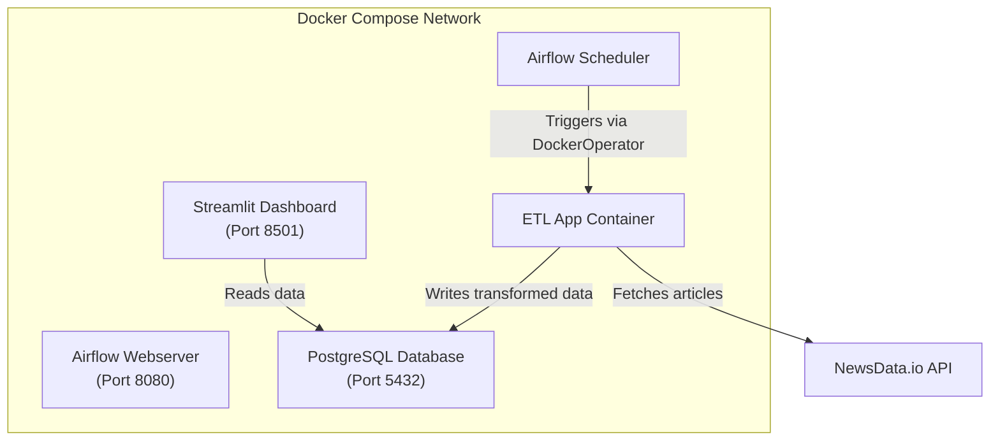

# News ETL Pipeline with Apache Airflow

A production-ready data engineering pipeline that automatically collects news articles from the web, analyzes their sentiment, and presents insights through an interactive dashboard. Built with industry-standard tools including Apache Airflow, PostgreSQL, and Docker.

## Project Status

**Complete** — All phases implemented: ETL pipeline, workflow orchestration, containerization, NLP processing, data validation, structured logging, dashboard visualization, incremental loading, and unit testing.

## Project Overview

This project implements a complete ETL (Extract, Transform, Load) pipeline that ingests news articles, enriches them with NLP-derived features, validates data quality, and presents insights through an interactive dashboard. The project addresses questions such as:

- How can automated pipelines reliably ingest data from external APIs?
- What patterns ensure data quality and prevent duplicate records?
- How do containerized architectures enable reproducible deployments?

## What This Project Does

This pipeline automatically:

1. **Collects** news articles from NewsData.io API on a daily schedule
2. **Analyzes** each headline's sentiment (positive, negative, or neutral)
3. **Validates** data quality before storage
4. **Stores** articles in a PostgreSQL database
5. **Displays** insights through an interactive web dashboard

The system only fetches new articles each run (incremental loading), avoiding duplicates and reducing API usage.

## Architecture


```mermaid
flowchart TB
    subgraph Docker["Docker Compose Network"]
        Scheduler["Airflow Scheduler"]
        Webserver["Airflow Webserver<br/>(Port 8080)"]
        Postgres["PostgreSQL Database<br/>(Port 5432)"]
        ETL["ETL App Container"]
        Dashboard["Streamlit Dashboard<br/>(Port 8501)"]
        
        Scheduler -->|"Triggers via DockerOperator"| ETL
        ETL -->|"Writes transformed data"| Postgres
        Dashboard -->|"Reads data"| Postgres
    end
    
    API["NewsData.io API"]
    ETL -->|"Fetches articles"| API
```

## Key Features

### Incremental Loading
The pipeline tracks the most recent article date and only fetches newer content on subsequent runs. This reduces API calls and prevents duplicate records.

### Sentiment Analysis
Each article headline is analyzed using TextBlob's natural language processing to determine sentiment polarity, scored from -1.0 (very negative) to +1.0 (very positive). News headlines typically score near 0.0 due to their neutral, factual writing style.

### Data Validation
A validation layer checks each article before database insertion:

- Verifies required fields exist (article ID, title or body)
- Confirms sentiment scores fall within valid range
- Detects duplicate articles within batches
- Logs rejected records with detailed error messages

### Pipeline Observability
All pipeline events are logged to a dedicated database table with structured metadata, enabling monitoring, debugging, and audit trails.

### Interactive Dashboard
A Streamlit dashboard provides real-time visualizations:

- Article ingestion trends over time
- Sentiment distribution analysis
- Top news sources breakdown
- Pipeline health monitoring

## Technical Stack

| Component | Technology | Purpose |
|-----------|------------|---------|
| Orchestration | Apache Airflow 2.8.1 | DAG scheduling, task management, monitoring |
| Database | PostgreSQL 14 | Article storage, Airflow metadata, pipeline logs |
| Containerization | Docker & Docker Compose | Service isolation, reproducible deployments |
| ETL Application | Python 3.13 | Data extraction, transformation, loading |
| NLP Processing | TextBlob, NLTK | Sentiment analysis |
| Data Validation | Custom validators | Data quality enforcement |
| Visualization | Streamlit, Plotly | Interactive dashboard |
| Testing | pytest | Unit tests for validation logic |

## Repository Structure

```
news-etl-pipeline/
├── dags/
│   └── news_etl_dag.py          # Airflow DAG definition
├── dashboard/
│   ├── Dockerfile               # Dashboard container image
│   ├── requirements.txt         # Dashboard dependencies
│   └── app.py                   # Streamlit application
├── tests/
│   ├── __init__.py              # Package initializer
│   └── test_validators.py       # Unit tests for validation
├── .dockerignore                # Files excluded from Docker builds
├── .env.example                 # Environment variable template
├── .gitattributes               # Git attributes configuration
├── .gitignore                   # Git ignore rules
├── docker-compose.yml           # Multi-container orchestration
├── Dockerfile                   # ETL application image
├── Dockerfile.airflow           # Custom Airflow image with Docker CLI
├── etl.py                       # Core ETL logic
├── validators.py                # Data validation module
├── init-db.sql                  # Database initialization
├── requirements.txt             # ETL dependencies
├── LICENSE                      # GPL v2.0 license
└── README.md
```

## Getting Started

### Prerequisites

- Docker Desktop installed and running
- A NewsData.io API key ([free tier available](https://newsdata.io/))

### Installation

1. Clone the repository:
```bash
git clone https://github.com/yourusername/news-etl-pipeline.git
cd news-etl-pipeline
```

2. Create your environment file:
```bash
cp .env.example .env
```

3. Edit `.env` and add your API key:
```
NEWS_API_KEY=your_actual_api_key_here
AIRFLOW_UID=50000
```

4. Build and start all services:
```bash
docker compose build etl_app
docker compose up --build -d
```

5. Access the services:
   - **Airflow UI**: http://localhost:8080 (credentials: admin/admin)
   - **Dashboard**: http://localhost:8501

6. Enable and trigger the `news_etl_pipeline` DAG from the Airflow interface

### Running Tests

```bash
docker compose run --rm etl_app pytest tests/
```

## Usage

### Manual Pipeline Trigger

Navigate to the Airflow UI, select the `news_etl_pipeline` DAG, and click the play button to trigger an immediate run.

### Scheduled Execution

The pipeline runs daily at midnight UTC. Ensure the DAG toggle is enabled in the Airflow UI for scheduled execution.

### Verify Data

Connect to PostgreSQL to query ingested articles:
```bash
docker exec -it de_postgres_db psql -U user -d news_db -c "SELECT title, sentiment_score FROM articles LIMIT 5;"
```

### View Pipeline Logs
```bash
docker exec -it de_postgres_db psql -U user -d news_db -c "SELECT run_timestamp, log_level, message FROM pipeline_logs ORDER BY run_timestamp DESC LIMIT 10;"
```

### Check Incremental Loading
```bash
docker exec -it de_postgres_db psql -U user -d news_db -c "SELECT run_timestamp, details->>'load_type' as load_type, details->>'articles_fetched' as fetched FROM pipeline_logs WHERE message = 'Pipeline run completed' ORDER BY run_timestamp DESC LIMIT 5;"
```

### Container Management

```bash
# Start services
docker compose up -d

# Stop services (preserves data)
docker compose down

# Stop services and delete data
docker compose down -v

# View logs
docker compose logs -f
```

## Technical Approach

### Data Ingestion

The pipeline connects to the NewsData.io API to retrieve English-language news articles. Incremental loading logic queries the database for the maximum `published_at` date and uses this as a filter, ensuring only new articles are fetched on subsequent runs.

### Data Transformation

Raw API responses undergo several transformations:

| Transformation | Description |
|----------------|-------------|
| Author Normalization | Converts list-type creator fields to comma-separated strings |
| Sentiment Scoring | Calculates polarity scores (-1.0 to 1.0) using TextBlob |
| Schema Enforcement | Ensures consistent data types across all records |

### Data Loading

The pipeline uses PostgreSQL's `ON CONFLICT DO UPDATE` clause to implement idempotent upserts:

```sql
INSERT INTO articles (id, title, author, body, source, published_at, sentiment_score)
VALUES (...)
ON CONFLICT (id) DO UPDATE SET
    title = EXCLUDED.title,
    sentiment_score = EXCLUDED.sentiment_score,
    updated_at = CURRENT_TIMESTAMP
```

This pattern ensures that re-running the pipeline with overlapping data updates existing records rather than creating duplicates.

## What This Project Demonstrates

### For Data Engineering Professionals

- **ETL Pipeline Design**: Complete extract-transform-load implementation with API integration, NLP enrichment, and database loading
- **Incremental Loading**: Efficient data fetching using watermark-based logic to minimize API calls
- **Data Quality**: Validation gates with structured error logging and graceful handling of invalid records
- **Idempotent Operations**: Upsert patterns ensuring safe pipeline reruns
- **Container Orchestration**: Multi-service Docker Compose with health checks and dependency management
- **Workflow Automation**: Airflow DAG with DockerOperator for containerized task execution

### For Software Engineers

- **Modular Architecture**: Separation of concerns across ETL, validation, and presentation layers
- **Type Hints**: Python type annotations for improved code clarity
- **Unit Testing**: pytest-based tests for validation logic
- **Documentation**: Comprehensive README and code docstrings
- **Version Control**: Proper .gitignore, .env.example, and repository structure

### For Hiring Managers

- **End-to-End Ownership**: Demonstrates ability to build complete data products from ingestion to visualization
- **Production Practices**: Implements logging, error handling, and monitoring patterns used in real-world systems
- **Industry Tools**: Hands-on experience with Airflow, Docker, PostgreSQL, and the Python data stack
- **Learning Approach**: Methodical, well-documented development process

## Known Limitations

### API Free Tier Constraints

The NewsData.io free tier does not provide full article body text. As a result:

- **Sentiment analysis is performed on headlines only**. This is a legitimate approach used in financial news monitoring and media analysis, though results differ from full-content analysis.
- **Neutral scores are common**. TextBlob's lexicon-based analysis returns 0.0 for factual headlines lacking sentiment-laden words (e.g., "FIFA announces 2026 World Cup schedule"). This accurately reflects the neutral tone of professional news writing.

The pipeline architecture fully supports complete content analysis when using a paid API tier that returns full article bodies.

### Local Development

This project runs on a single machine using Docker Compose. Production deployments would typically use Kubernetes, managed Airflow (e.g., Cloud Composer, MWAA), and cloud-hosted databases.

## License

This project is licensed under the GNU General Public License v2.0. See the [LICENSE](https://github.com/axelcabato/news-etl-pipeline/blob/main/LICENSE) file for details.

## About the Author

I am building expertise in data engineering with a foundation in business administration and marketing. This project represents my commitment to developing rigorous technical skills and my approach to learning: methodical, well-documented, and focused on industry-relevant practices.

I welcome feedback from experienced data professionals and am eager to discuss the engineering approaches demonstrated in this project.

## Connect

**LinkedIn**: [linkedin.com/in/axelcabato](https://linkedin.com/in/axelcabato)

**Email**: contact@axelcabato.com

---

*Project completed July 2026*
